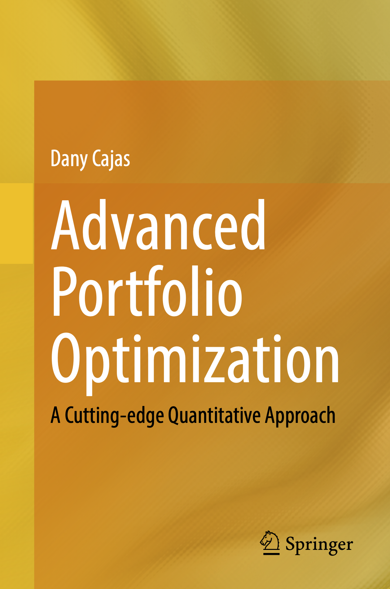
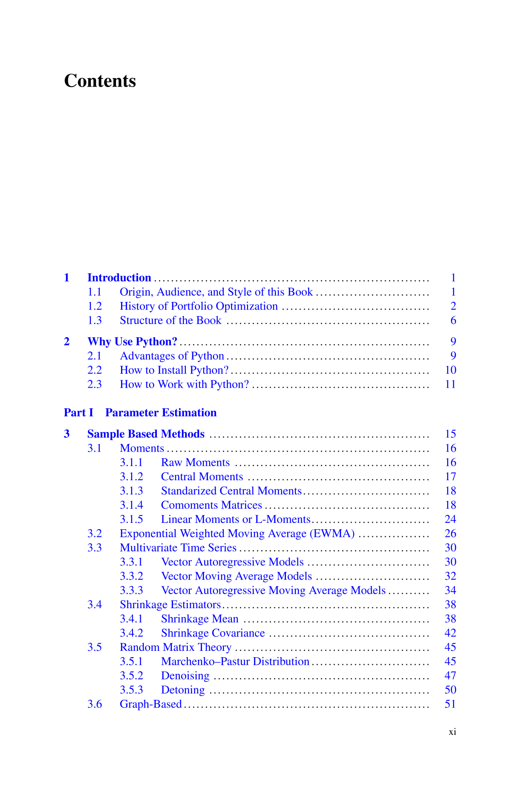
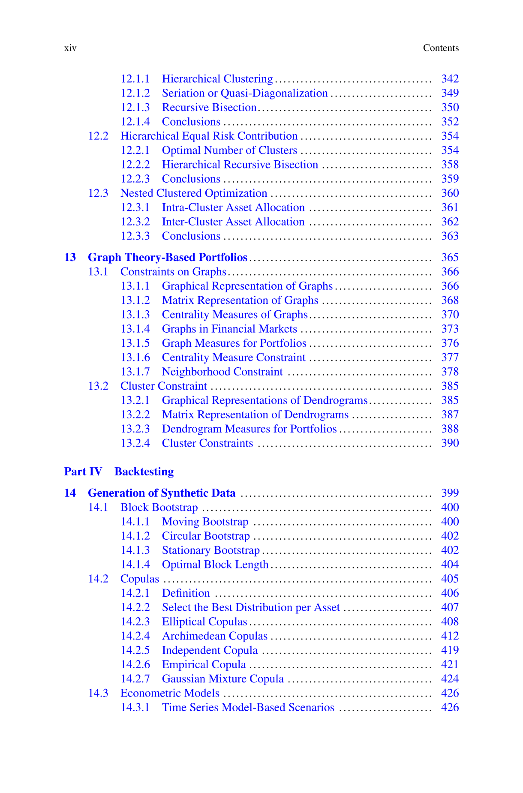
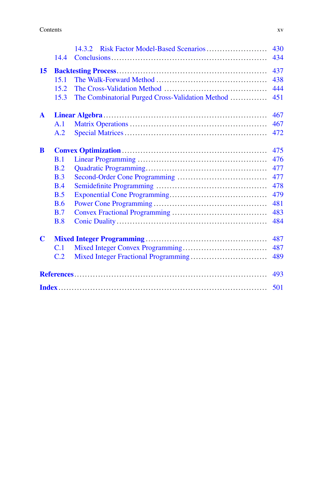

#####################################################################
Advanced Portfolio Optimization: A Cutting-edge Quantitative Approach
#####################################################################

.. meta::
   :description: Portfolio Optimization Book

.. raw:: html

    <a href="https://www.kqzyfj.com/click-101359873-15150084?url=https%3A%2F%2Flink.springer.com%2Fbook%2F9783031843037" target="_blank">
        <button style="padding:10px 20px; font-size:16px; background-color: #FFA500; color:white; border:none; border-radius:5px; cursor:pointer; font-weight: bold;">
            Buy Advanced Portfolio Optimization Book on Springer
        </button>
    </a>
     
     

.. raw:: html
    
    <a href="https://www.paypal.com/ncp/payment/GN55W4UQ7VAMN" target="_blank">
        <button style="padding:10px 20px; font-size:16px; background-color: #32CD32; color:white; border:none; border-radius:5px; cursor:pointer; font-weight: bold;">
            Enroll in the Portfolio Optimization with Python Course
        </button>
    </a>
     
     

.. image:: https://img.shields.io/static/v1?label=Sponsor&message=%E2%9D%A4&logo=GitHub&color=%23fe8e86
   :target: https://github.com/sponsors/dcajasn
   :height: 1.75em

.. raw:: html
   
     
   
.. raw:: html

    

Motivation
==========

This book attempts to fill the gap that exists in quantitative finance books and courses that only focus
on the mean-variance model and its variants, and ignore the further developments made in the last 70 years
after the publication of Markowitz's pioneering work. Readers will find this book very useful because each
section explains the idea and mathematics of each model, and each section is accompanied by its corresponding
Python code that allows all the examples to be reproduced.

**It is important to note that sales of this book help fund the continuous development
and maintenance of Riskfolio-Lib. As a personal open-source project, Riskfolio-Lib is
not financially supported by any institution or organization, unlike many other popular
Python projects.**

Buy Online
==========

.. raw:: html

    <a href="https://www.anrdoezrs.net/click-101359873-15150084?url=https%3A%2F%2Flink.springer.com%2Fbook%2F9783031843037" target="_blank">
        <button style="padding:10px 20px; font-size:16px; background-color: #FFA500; color:white; border:none; border-radius:5px; cursor:pointer;">
            Buy Advanced Portfolio Optimization Book on Springer
        </button>
    </a>
     
     

.. raw:: html

    <a href="https://a.co/d/008fdzCx" target="_blank">
        <button style="padding:10px 20px; font-size:16px; background-color: #996600; color:white; border:none; border-radius:5px; cursor:pointer;">
            Buy Advanced Portfolio Optimization Book on Amazon
        </button>
    </a>

Table of Contents
=================

.. image:: ../images/Contents-3.png

.. image:: ../images/Contents-4.png

