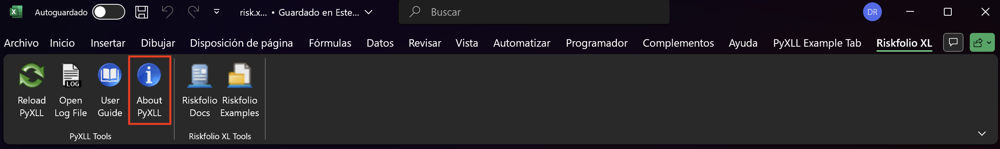
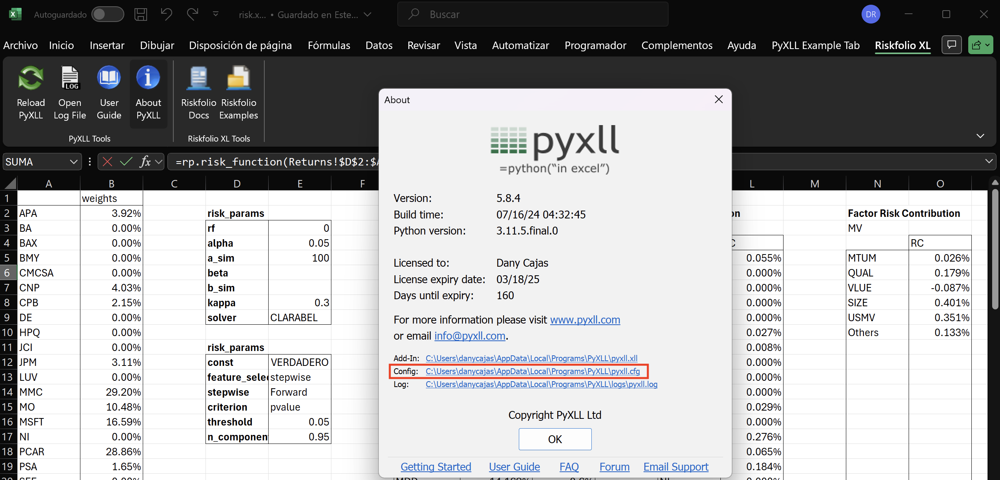
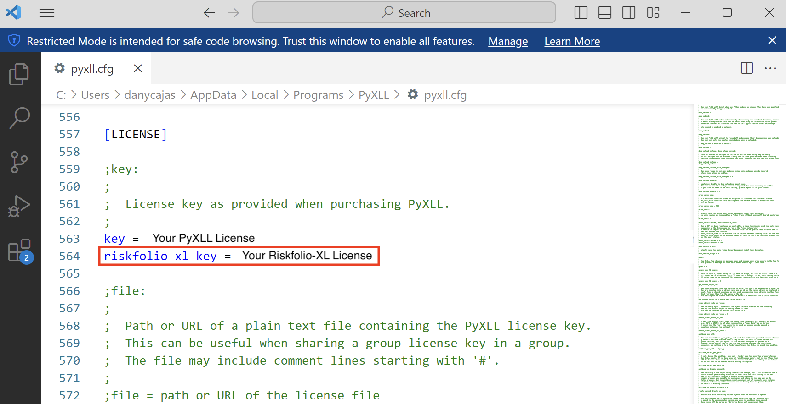

######################################################
Riskfolio-XL: Riskfolio-Lib add-in for Microsoft Excel
######################################################

.. raw:: html

    <a href="https://www.kqzyfj.com/click-101359873-15150084?url=https%3A%2F%2Flink.springer.com%2Fbook%2F9783031843037" target="_blank">
        <button style="padding:10px 20px; font-size:16px; background-color: #FFA500; color:white; border:none; border-radius:5px; cursor:pointer;">
            Buy Advanced Portfolio Optimization Book on Springer
        </button>
    </a>
     
     

.. image:: https://img.shields.io/static/v1?label=Sponsor&message=%E2%9D%A4&logo=GitHub&color=%23fe8e86
 :target: https://github.com/sponsors/dcajasn

.. raw:: html
   
     
   
.. raw:: html

    

Description
===========

Riskfolio-XL is a Microsoft Excel add-in based on `PyXLL <https://www.pyxll.com/index.html>`_ library, that allows users use the same features of Riskfolio-Lib in Excel through Riskfolio-XL spreadsheet functions. Its objective is to help non-programming users to build investment portfolios based on mathematically complex models with low effort and to support the maintenance and further development of Riskfolio-Lib.

Installation
============

Riskfolio-XL is only available on Windows and it requires a valid installation of PyXLL package and PyXLL add-in. To install PyXLL and PyXLL add-in, you can find the PyXLL installation instructions in the following `link <https://www.pyxll.com/docs/userguide/installation/firsttime.html>`_.

After installing the PyXLL package and PyXLL add-in, the latest stable release of Riskfolio-XL (and older versions) can be installed from PyPI:

  ::
    
      pip install riskfolio-xl

After installing the Riskfolio-XL package you will have access to the **TRIAL COPY** of Riskfolio-XL, this version is limited to work only with portfolios of 7 assets and risk factor models of 3 risk factors.

To access the **PURCHASED COPY** of Riskfolio-XL, you need a valid license. To get a Riskfolio-XL license you have to purchase it paying a monthly or annual subscription:

.. raw:: html

   
   

   <button class="tablinks" onclick="openTab(event, 'paypal-container-DLABCNSPX8LZL')" id="defaultOpen">Monthly License</button>
   <button class="tablinks" onclick="openTab(event, 'paypal-container-KKZBWK6JK8ZDA')">Annual License</button>
   

   
   

   

   
    

**After paying, you need to send us an email to** `orenji.eirl@gmail.com <orenji.eirl@gmail.com>`_ **and you will receive your Riskfolio-XL license (within 24 hours) and a discount code to purchase the PyXLL package.**

Then, you have to add your Riskfolio-XL license to the pyxll.cfg file:

* First, click on About PyXLL button of Riskfolio-XL add-in as shown in the image below:

* Then, click on the config file link as shown in the image below:

* Finally, write your Riskfolio-XL license in the riskfolio_xl_key parameter as shown in the image below:

Citing
======

If you use Riskfolio-Lib for published work, please use the following BibTeX entry:

::

    @misc{riskfolioxl,
          author = {Dany Cajas},
          title = {Riskfolio-LXLib (0.1.1)},
          year  = {2024},
          url   = {https://riskfolio-lib.readthedocs.io/en/latest/excel.html},
          }

License
=======

.. include:: ../../LICENSE-XL.txt