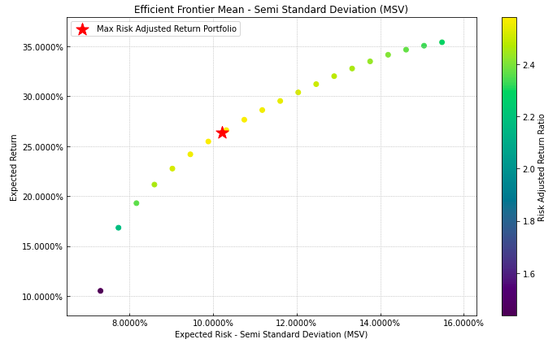
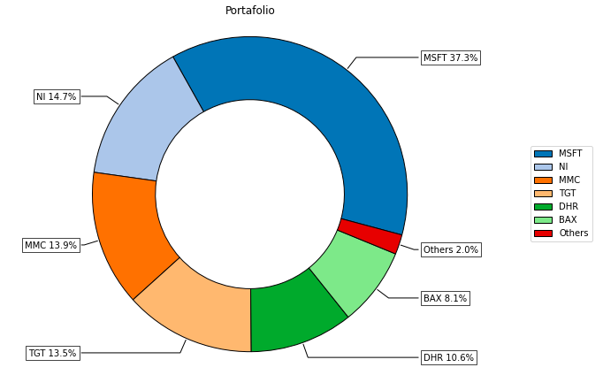

#############
Riskfolio-Lib
#############

.. meta::
   :description lang=en: Portfolio Optimization and Quantitative Strategic Asset Allocation in Python.
   :description lang=es: Optimización de Portafolios y Asignación Estratégica de Activos con Python.
   :keywords lang=en: portfolio optimization python, portfolio optimization, Markowitz portfolio optimization, cvar portfolio optimization, asset allocation, strategic asset allocation
   :keywords lang=es: optimización de portafolios python, optimización de portafolios, optimización de portafolios de Markowitz, optimización de portafolios con cvar, asignación de activos, asignación estratégica de activos

**Quantitative Strategic Asset Allocation, Easy for Everyone.**

    

.. raw:: html

     

.. image:: https://img.shields.io/github/stars/dcajasn/Riskfolio-Lib?color=green   :alt: GitHub stars   :target: https://github.com/dcajasn/Riskfolio-Lib/stargazers
.. image:: https://static.pepy.tech/personalized-badge/riskfolio-lib?period=month&units=none&left_color=grey&right_color=orange&left_text=Downloads/Month
 :target: https://pepy.tech/project/riskfolio-lib
.. image:: https://readthedocs.org/projects/riskfolio-lib/badge/?version=latest
.. raw:: html

    

.. image:: https://mybinder.org/badge_logo.svg
 :target: https://mybinder.org/v2/gh/dcajasn/Riskfolio-Lib/HEAD

Description
===========

Riskfolio-Lib is a library for making portfolio optimization and quantitative strategic asset allocation in Python made in Peru |:peru:|. Its objective is to help students, academics and practitioners to build investment portfolios based on mathematically complex models with low effort. It is built on top of
`CVXPY <https://www.cvxpy.org/>`_ and closely integrated
with `pandas <https://pandas.pydata.org/>`_ data structures.

Some of key functionalities that Riskfolio-Lib offers:

- Mean Risk Portfolio optimization with 4 objective functions:

    - Minimum Risk.
    - Maximum Return.
    - Maximum Utility Function.
    - Maximum Risk Adjusted Return Ratio.

- Mean Risk Portfolio optimization with 13 convex risk measures:

    - Standard Deviation.
    - Semi Standard Deviation.
    - Mean Absolute Deviation (MAD).
    - First Lower Partial Moment (Omega Ratio)
    - Second Lower Partial Moment (Sortino Ratio)
    - Conditional Value at Risk (CVaR).
    - Entropic Value at Risk (EVaR).
    - Worst Case Realization (Minimax Model)
    - Maximum Drawdown (Calmar Ratio).
    - Average Drawdown
    - Conditional Drawdown at Risk (CDaR).
    - Entropic Drawdown at Risk (EDaR).
    - Ulcer Index.

- Risk Parity Portfolio optimization with 10 convex risk measures:

    - Standard Deviation.
    - Semi Standard Deviation.
    - Mean Absolute Deviation (MAD).
    - First Lower Partial Moment (Omega Ratio)
    - Second Lower Partial Moment (Sortino Ratio)
    - Conditional Value at Risk (CVaR).
    - Entropic Value at Risk (EVaR).
    - Conditional Drawdown at Risk (CDaR).
    - Entropic Drawdown at Risk (EDaR).
    - Ulcer Index.

- Worst Case Mean Variance Portfolio optimization.
- Portfolio optimization with Black Litterman model.
- Portfolio optimization with Risk Factors model.
- Portfolio optimization with constraints on tracking error and turnover.
- Portfolio optimization with short positions and leveraged portfolios.
- Tools to build efficient frontier for 13 risk measures.
- Tools to build linear constraints on assets, asset classes and risk factors.
- Tools to build views on assets and asset classes.
- Tools to calculate risk measures.
- Tools to calculate risk contributions per asset.
- Tools to calculate uncertainty sets for mean vector and covariance matrix.
- Tools to estimate loadings matrix (Stepwise Regression and Principal Components Regression).
- Tools to visualizing portfolio properties and risk measures.
- Tools to build reports on Jupyter Notebook and Excel. 
- Option to use commercial optimization solver like MOSEK or GUROBI for large scale problems.

Contents
========

..  toctree::
    :maxdepth: 1

    Install <install>
    Portfolio Models <portfolio>
    Parameters Estimation <parameters>
    Constraints Functions <constraints>
    Risk Functions <risk>
    Plot Functions <plot>
    Reports <reports>
    Auxiliary Functions <auxiliary>
    Examples <examples>
    Contributing <contributing>
    Authors <authors>
    License <license>
    Changelog <changelog>

    
Indices and tables
==================

* :ref:`genindex`
* :ref:`modindex`
* :ref:`search`

Module Plans
==================

The plan for this library is to add more functions that will be very useful
for students, academics and practitioners.

* Add Black Litterman for factors models.
* Add functions to estimate Duration, Convexity, Key Rate Durations and Convexities of bonds without embedded options (for loadings matrix).
* Add more functions based on suggestion of users.
