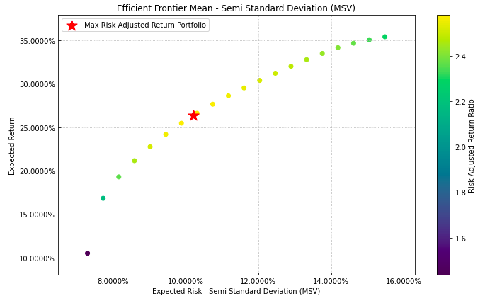
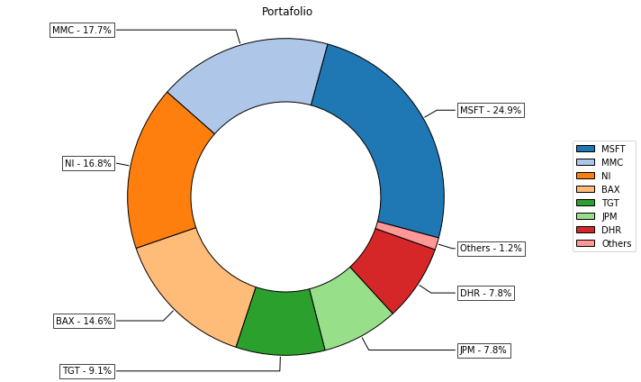

#############
Riskfolio-Lib
#############

.. meta::
    :keywords: portfolio optimization,
               portfolio optimization in python,
               portfolio optimization with python,
               python portfolio optimization,
               quantitative finance,
               risk management,
               portfolio backtesting,
               robust optimization,
               riskfolio

    :description: Portfolio optimization in Python with Riskfolio-Lib.

..........................................................
Portfolio Optimization in Python, Easy for Everyone
..........................................................

.. raw:: html

    <a href="https://www.kqzyfj.com/click-101359873-15150084?url=https%3A%2F%2Flink.springer.com%2Fbook%2F9783031843037" target="_blank">
        <button style="padding:10px 20px; font-size:16px; background-color: #FFA500; color:white; border:none; border-radius:5px; cursor:pointer; font-weight: bold;">
            Buy Advanced Portfolio Optimization Book on Springer
        </button>
    </a>
     
     

.. raw:: html
    
    <a href="https://www.paypal.com/ncp/payment/GN55W4UQ7VAMN" target="_blank">
        <button style="padding:10px 20px; font-size:16px; background-color: #32CD32; color:white; border:none; border-radius:5px; cursor:pointer; font-weight: bold;">
            Enroll in the Portfolio Optimization with Python Course
        </button>
    </a>
     
     

    

.. image:: https://img.shields.io/static/v1?label=Sponsor&message=%E2%9D%A4&logo=GitHub&color=%23fe8e86
   :target: https://github.com/sponsors/dcajasn
   :height: 1.75em

.. raw:: html
   
    

.. raw:: html

     

.. image:: https://img.shields.io/github/stars/dcajasn/Riskfolio-Lib
   :alt: GitHub stars
   :target: https://github.com/dcajasn/Riskfolio-Lib/stargazers
   :height: 1.6em
.. image:: https://static.pepy.tech/personalized-badge/riskfolio-lib?period=total&units=INTERNATIONAL_SYSTEM&left_color=GREY&right_color=BRIGHTGREEN&left_text=downloads
   :target: https://pepy.tech/project/riskfolio-lib
   :height: 1.6em
.. image:: https://static.pepy.tech/personalized-badge/riskfolio-lib?period=monthly&units=INTERNATIONAL_SYSTEM&left_color=GREY&right_color=ORANGE&left_text=downloads%2Fmonth
   :target: https://pepy.tech/project/riskfolio-lib
   :height: 1.6em
.. image:: https://readthedocs.org/projects/riskfolio-lib/badge/?version=latest
   :height: 1.6em
.. image:: https://img.shields.io/github/license/dcajasn/Riskfolio-Lib
   :alt: GitHub license
   :target: https://github.com/dcajasn/Riskfolio-Lib/blob/master/LICENSE.txt
   :height: 1.6em
.. image:: https://mybinder.org/badge_logo.svg
   :target: https://mybinder.org/v2/gh/dcajasn/Riskfolio-Lib/HEAD
   :height: 1.6em

.. |linkedin| raw:: html

    

.. |email| raw:: html

    

Description
===========

Riskfolio-Lib is a library for making **Portfolio Optimization in Python** made in Peru |:peru:|. 
Its objective is to help students, academics and practitioners to build 
investment portfolios based on mathematically complex models with low effort. It is built on top of
`CVXPY <https://www.cvxpy.org/>`_ and closely integrated with `Pandas <https://pandas.pydata.org/>`_ data structures.

Some of key functionalities that Riskfolio-Lib offers:

* Mean Risk and Logarithmic Mean Risk (Kelly Criterion) Portfolio Optimization with 4 objective functions:

  * Minimum Risk.
  * Maximum Return.
  * Maximum Utility Function.
  * Maximum Risk Adjusted Return Ratio.

* Mean Risk and Logarithmic Mean Risk (Kelly Criterion) Portfolio Optimization with 26 convex risk measures:

  **Dispersion Risk Measures:**

  * Standard Deviation.
  * Square Root Kurtosis.
  * p-th Root of Even Moment of Order 2p.
  * Mean Absolute Deviation (MAD).
  * Gini Mean Difference (GMD).
  * Conditional Value at Risk Range.
  * Tail Gini Range.
  * Entropic Value at Risk Range.
  * Relativistic Value at Risk Range.
  * Range.

  **Downside Risk Measures:**

  * Semi Standard Deviation.
  * Square Root Semi Kurtosis.
  * p-th Root of Even Semi Moment of Order 2p.
  * First Lower Partial Moment (Omega Ratio).
  * Second Lower Partial Moment (Sortino Ratio).
  * Conditional Value at Risk (CVaR).
  * Tail Gini.
  * Entropic Value at Risk (EVaR).
  * Relativistic Value at Risk (RLVaR).
  * Worst Realization (Minimax).

  **Drawdown Risk Measures:**

  * Average Drawdown for uncompounded cumulative returns.
  * Ulcer Index for uncompounded cumulative returns.
  * Conditional Drawdown at Risk (CDaR) for uncompounded cumulative returns.
  * Entropic Drawdown at Risk (EDaR) for uncompounded cumulative returns.
  * Relativistic Drawdown at Risk (RLDaR) for uncompounded cumulative returns.
  * Maximum Drawdown (Calmar Ratio) for uncompounded cumulative returns.

* Risk Parity Portfolio Optimization with 22 convex risk measures:

  **Dispersion Risk Measures:**

  * Standard Deviation.
  * Square Root Kurtosis.
  * p-th Root of Even Moment of Order 2p.
  * Mean Absolute Deviation (MAD).
  * Gini Mean Difference (GMD).
  * Conditional Value at Risk Range.
  * Tail Gini Range.
  * Entropic Value at Risk Range.
  * Relativistic Value at Risk Range.

  **Downside Risk Measures:**

  * Semi Standard Deviation.
  * Square Root Semi Kurtosis.
  * p-th Root of Even Semi Moment of Order 2p.
  * First Lower Partial Moment (Omega Ratio)
  * Second Lower Partial Moment (Sortino Ratio)
  * Conditional Value at Risk (CVaR).
  * Tail Gini.
  * Entropic Value at Risk (EVaR).
  * Relativistic Value at Risk (RLVaR).

  **Drawdown Risk Measures:**

  * Ulcer Index for uncompounded cumulative returns.
  * Conditional Drawdown at Risk (CDaR) for uncompounded cumulative returns.
  * Entropic Drawdown at Risk (EDaR) for uncompounded cumulative returns.
  * Relativistic Drawdown at Risk (RLDaR) for uncompounded cumulative returns.

* Hierarchical Clustering Portfolio Optimization: Hierarchical Risk Parity (HRP) and Hierarchical Equal Risk Contribution (HERC) with 37 risk measures using naive risk parity:

  **Dispersion Risk Measures:**

  * Standard Deviation.
  * Variance.
  * Fourth Root Kurtosis.
  * 2p-th Root of Even Moment of Order 2p.
  * Mean Absolute Deviation (MAD).
  * Gini Mean Difference (GMD).
  * Value at Risk Range.
  * Conditional Value at Risk Range.
  * Tail Gini Range.
  * Entropic Value at Risk Range.
  * Relativistic Value at Risk Range.
  * Range.

  **Downside Risk Measures:**

  * Semi Standard Deviation.
  * Fourth Root Semi Kurtosis.
  * 2p-th Root of Even Semi Moment of Order 2p.
  * First Lower Partial Moment (Omega Ratio).
  * Second Lower Partial Moment (Sortino Ratio).
  * Value at Risk (VaR).
  * Conditional Value at Risk (CVaR).
  * Entropic Value at Risk (EVaR).
  * Relativistic Value at Risk (RLVaR).
  * Tail Gini.
  * Worst Case Realization (Minimax).

  **Drawdown Risk Measures:**

  * Average Drawdown for compounded and uncompounded cumulative returns.
  * Ulcer Index for compounded and uncompounded cumulative returns.
  * Drawdown at Risk (DaR) for compounded and uncompounded cumulative returns.
  * Conditional Drawdown at Risk (CDaR) for compounded and uncompounded cumulative returns.
  * Entropic Drawdown at Risk (EDaR) for compounded and uncompounded cumulative returns.
  * Relativistic Drawdown at Risk (RLDaR) for compounded and uncompounded cumulative returns.
  * Maximum Drawdown (Calmar Ratio) for compounded and uncompounded cumulative returns.

* Nested Clustered Optimization (NCO) with four objective functions and the available risk measures to each objective:

  * Minimum Risk.
  * Maximum Return.
  * Maximum Utility Function.
  * Equal Risk Contribution.

* Worst Case Mean Variance Portfolio Optimization.
* Relaxed Risk Parity Portfolio Optimization.
* Ordered Weighted Averaging (OWA) Portfolio Optimization.
* Mean-Variance-Skewness-Kurtosis (MVSK) Portfolio Optimization (Semidefinite Relaxation).
* Portfolio optimization with Black Litterman model.
* Portfolio optimization with Risk Factors model.
* Portfolio optimization with Black Litterman Bayesian model.
* Portfolio optimization with Augmented Black Litterman model.
* Portfolio optimization with Entropy Pooling model.
* Portfolio optimization with constraints on tracking error and turnover.
* Portfolio optimization with short positions and leveraged portfolios.
* Portfolio optimization with constraints on number of assets and number of effective assets.
* Portfolio optimization with constraints based on graph information.
* Portfolio optimization with inequality constraints on risk contributions for variance.
* Portfolio optimization with inequality constraints on factor risk contributions for variance.
* Portfolio optimization with integer constraints such as Cardinality on Assets and Categories, Mutually Exclusive and Join Investment.
* Tools to build efficient frontier for 26 convex risk measures.
* Tools to build linear constraints on assets, asset classes and risk factors.
* Tools to build views on assets and asset classes.
* Tools to build views on risk factors.
* Tools to build risk contribution constraints per asset classes.
* Tools to build risk contribution constraints per risk factor using explicit risk factors and principal components.
* Tools to build bounds constraints for Hierarchical Clustering Portfolios.
* Tools to calculate risk measures.
* Tools to calculate risk contributions per asset.
* Tools to calculate risk contributions per risk factor.
* Tools to calculate uncertainty sets for mean vector and covariance matrix.
* Tools to calculate assets clusters based on codependence metrics.
* Tools to estimate loadings matrix (Stepwise Regression and Principal Components Regression).
* Tools to visualizing portfolio properties and risk measures.
* Tools to build reports on Jupyter Notebook and Excel. 
* Option to use commercial optimization solvers such as MOSEK or GUROBI for large scale problems.

Choosing a Solver
=================

Due to Riskfolio-Lib is based on CVXPY, Riskfolio-Lib can use the same solvers available for CVXPY.
The list of solvers compatible with CVXPY is available in `Choosing a solver <https://www.cvxpy.org/tutorial/solvers/index.html#choosing-a-solver>`_ section of CVXPY's documentation.
However, to select an adequate solver for each risk measure we can use the following table
that specifies which type of programming technique is used to model each risk measure.

.. raw:: html

    <link href='http://fonts.googleapis.com/css?family=Roboto' rel='stylesheet' type='text/css'>
    
    <table class="tg">
        <thead>
        <tr>
            <th class="tg-huut">Risk Measure</th>
            <th class="tg-huut">LP</th>
            <th class="tg-huut">QP</th>
            <th class="tg-huut">SOCP</th>
            <th class="tg-huut">SDP</th>
            <th class="tg-huut">EXP</th>
            <th class="tg-huut">POW</th>
        </tr>
        </thead>
        <tbody>
        <tr>
            <td>Variance (MV)</td>
            <td></td>
            <td></td>
            <td style='text-align:center'>X</td>
            <td style='text-align:center'>X*</td>
            <td></td>
            <td></td>
        </tr>
        <tr>
            <td>Mean Absolute Deviation (MAD)</td>
            <td style='text-align:center'>X</td>
            <td></td>
            <td></td>
            <td></td>
            <td></td>
            <td></td>
        </tr>
        <tr>
            <td>Gini Mean Difference (GMD)</td>
            <td></td>
            <td></td>
            <td></td>
            <td></td>
            <td></td>
            <td style='text-align:center'>X**</td>
        </tr>
        <tr>
            <td>Semi Variance (MSV)</td>
            <td></td>
            <td></td>
            <td style='text-align:center'>X</td>
            <td></td>
            <td></td>
            <td></td>
        </tr>
        <tr>
            <td>Kurtosis (KT)</td>
            <td></td>
            <td></td>
            <td></td>
            <td style='text-align:center'>X</td>
            <td></td>
            <td></td>
        </tr>
        <tr>
            <td>Even Moment (EM)</td>
            <td></td>
            <td></td>
            <td></td>
            <td></td>
            <td></td>
            <td style='text-align:center'>X**</td>
        </tr>
        <tr>
            <td>Semi Kurtosis (SKT)</td>
            <td></td>
            <td></td>
            <td></td>
            <td style='text-align:center'>X</td>
            <td></td>
            <td></td>
        </tr>
        <tr>
            <td>Even Semi Moment (ESM)</td>
            <td></td>
            <td></td>
            <td></td>
            <td></td>
            <td></td>
            <td style='text-align:center'>X**</td>
        </tr>
        <tr>
            <td>First Lower Partial Moment (FLPM)</td>
            <td style='text-align:center'>X</td>
            <td></td>
            <td></td>
            <td></td>
            <td></td>
            <td></td>
        </tr>
        <tr>
            <td>Second Lower Partial Moment (SLPM)</td>
            <td></td>
            <td></td>
            <td style='text-align:center'>X</td>
            <td></td>
            <td></td>
            <td></td>
        </tr>
        <tr>
            <td>Conditional Value at Risk (CVaR)</td>
            <td style='text-align:center'>X</td>
            <td></td>
            <td></td>
            <td></td>
            <td></td>
            <td></td>
        </tr>
        <tr>
            <td>Tail Gini (TG)</td>
            <td></td>
            <td></td>
            <td></td>
            <td></td>
            <td></td>
            <td style='text-align:center'>X**</td>
        </tr>
        <tr>
            <td>Entropic Value at Risk (EVaR)</td>
            <td></td>
            <td></td>
            <td></td>
            <td></td>
            <td style='text-align:center'>X**</td>
            <td></td>
        </tr>
        <tr>
            <td>Relativistic Value at Risk (RLVaR)</td>
            <td></td>
            <td></td>
            <td></td>
            <td></td>
            <td></td>
            <td style='text-align:center'>X**</td>
        </tr>
        <tr>
            <td>Worst Realization (WR)</td>
            <td style='text-align:center'>X</td>
            <td></td>
            <td></td>
            <td></td>
            <td></td>
            <td></td>
        </tr>
        <tr>
            <td>CVaR Range (CVRG)</td>
            <td style='text-align:center'>X</td>
            <td></td>
            <td></td>
            <td></td>
            <td></td>
            <td></td>
        </tr>
        <tr>
            <td>Tail Gini Range (TGRG)</td>
            <td></td>
            <td></td>
            <td></td>
            <td></td>
            <td></td>
            <td style='text-align:center'>X**</td>
        </tr>
        <tr>
            <td>EVaR Range (EVRG)</td>
            <td></td>
            <td></td>
            <td></td>
            <td></td>
            <td style='text-align:center'>X**</td>
            <td></td>
        </tr>
        <tr>
            <td>RLVaR Range (RVRG)</td>
            <td></td>
            <td></td>
            <td></td>
            <td></td>
            <td></td>
            <td style='text-align:center'>X**</td>
        </tr>
        <tr>
            <td>Range (RG)</td>
            <td style='text-align:center'>X</td>
            <td></td>
            <td></td>
            <td></td>
            <td></td>
            <td></td>
        </tr>
        <tr>
            <td>Average Drawdown (ADD)</td>
            <td style='text-align:center'>X</td>
            <td></td>
            <td></td>
            <td></td>
            <td></td>
            <td></td>
        </tr>
        <tr>
            <td>Ulcer Index (UCI)</td>
            <td></td>
            <td></td>
            <td style='text-align:center'>X</td>
            <td></td>
            <td></td>
            <td></td>
        </tr>
        <tr>
            <td>Conditional Drawdown at Risk (CDaR)</td>
            <td style='text-align:center'>X</td>
            <td></td>
            <td></td>
            <td></td>
            <td></td>
            <td></td>
        </tr>
        <tr>
            <td>Entropic Drawdown at Risk (EDaR)</td>
            <td></td>
            <td></td>
            <td></td>
            <td></td>
            <td style='text-align:center'>X**</td>
            <td></td>
        </tr>
        <tr>
            <td>Relativistic Drawdown at Risk (RLDaR)</td>
            <td></td>
            <td></td>
            <td></td>
            <td></td>
            <td></td>
            <td style='text-align:center'>X**</td>
        </tr>
        <tr>
            <td>Maximum Drawdown (MDD)</td>
            <td style='text-align:center'>X</td>
            <td></td>
            <td></td>
            <td></td>
            <td></td>
            <td></td>
        </tr>
        </tbody>
    </table>

(*) When SDP graph theory constraints or risk contribution constraints are included. In the case integer programming graph theory constraints are included, the model assume the SOCP formulation.

(**) For these models is highly recommended to use MOSEK as solver, due to in some cases CLARABEL cannot find a solution and SCS takes too much time to solve them.

LP: Linear Programming refers to problems with a linear objective function and linear constraints.

QP: Quadratic Programming refers to problems with a quadratic objective function and linear constraints.

SOCP: Second Order Cone Programming refers to problems with second-order cone constraints.

SDP: Semidefinite Programming refers to problems with positive semidefinite constraints.

EXP:refers to problems with exponential cone constraints.

POW: refers to problems with 3-dimensional power cone constraints.

Contributing
============

Contributions of all kinds are welcome and greatly appreciated. Riskfolio-Lib is an 
independent open-source project, and community support plays a vital role in its 
continued development, maintenance, and growth.

Financial Support
-----------------

If you would like to support the long-term sustainability of Riskfolio-Lib, you can 
contribute financially in any of the following ways:

* Purchase my book `Advanced Portfolio Optimization: a Cutting-Edge Quantitative Approach <https://www.kqzyfj.com/click-101359873-15150084?url=https%3A%2F%2Flink.springer.com%2Fbook%2F9783031843037>`_.
* Enroll in my course `Portfolio Optimization with Python <https://www.paypal.com/ncp/payment/GN55W4UQ7VAMN>`_.
* Become a sponsor through `GitHub Sponsors <https://github.com/sponsors/dcajasn>`_.
* Make a donation via `Ko-fi <https://ko-fi.com/B0B833SXD>`_.
* Hire me for consulting services through my |linkedin| `LinkedIn <https://www.linkedin.com/in/dany-cajas/>`_ or contact me by email |email| `Email <mailto:dcajasn@gmail.com>`_.

Other Ways to Contribute
------------------------

You can also contribute directly to the project by:

* Improve and expand the documentation.
* Enhance the performance and efficiency of existing code.
* Implement new optimization objectives, risk measures, robust estimation techniques, and 
  other portfolio optimization features.
* Develop additional examples and tutorials using Jupyter notebooks.
* Help expand the test suite by writing and improving tests with pytest.
* Suggest journal articles, research papers, blog posts, or other resources related to 
  portfolio optimization, quantitative finance, machine learning or econometrics that 
  could inspire new features or improvements in Riskfolio-Lib.

Whether you contribute code, documentation, examples, tests, ideas, feedback, financial 
support, or simply help spread the word about Riskfolio-Lib, your support helps make the 
project a better tool for the quantitative finance community.

Citing
======

If you use Riskfolio-Lib for published work, please use the following BibTeX entry:

::

    @misc{riskfolio,
          author = {Dany Cajas},
          title = {Riskfolio-Lib (7.3)},
          year  = {2026},
          url   = {https://github.com/dcajasn/Riskfolio-Lib},
          }

    
Indices and tables
==================

* :ref:`genindex`
* :ref:`modindex`
* :ref:`search`

Module Plans
============

The plan for this library is to add more functions that will be very useful
for students, academics and practitioners.

* Add more functions based on suggestion of users.

.. toctree::
   :hidden:

    Riskfolio-Lib<riskfoliolib/index>

.. toctree::
    :hidden:

    Riskfolio-XL<riskfolioxl/index>

.. toctree::
    :hidden:

    Book<book/book>

.. toctree::
    :hidden:

    Course<course/course>

.. toctree::
    :hidden:

    Author <authors/index>