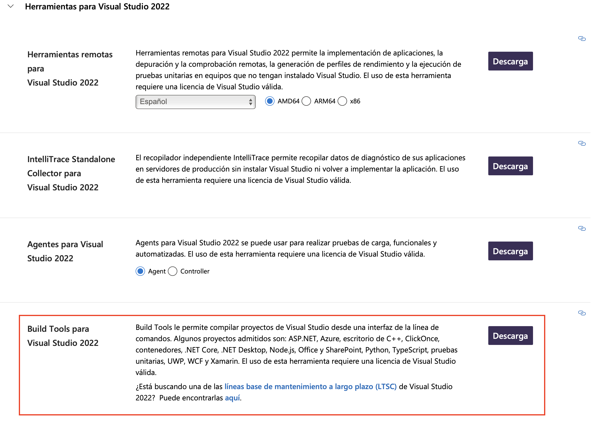
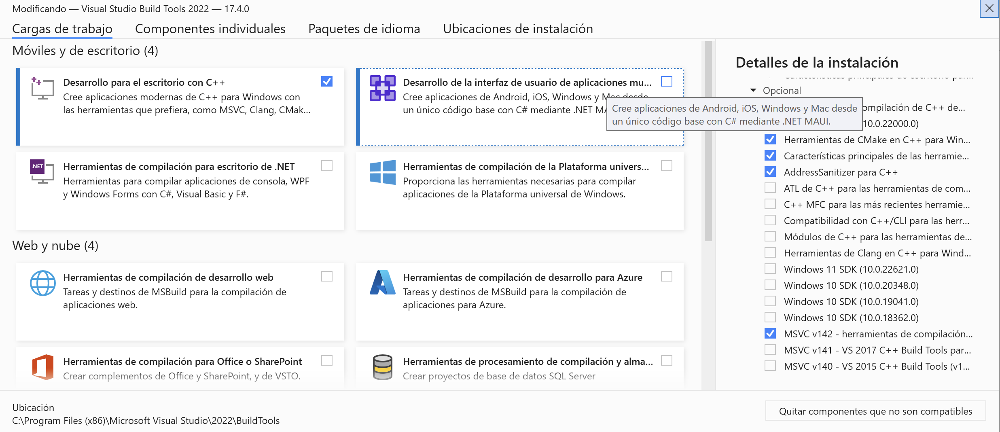

#######
Install
#######

.. raw:: html

    <a href="https://www.kqzyfj.com/click-101359873-15150084?url=https%3A%2F%2Flink.springer.com%2Fbook%2F9783031843037" target="_blank">
        <button style="padding:10px 20px; font-size:16px; background-color: #FFA500; color:white; border:none; border-radius:5px; cursor:pointer;">
            Buy Advanced Portfolio Optimization Book on Springer
        </button>
    </a>
     
     

.. image:: https://img.shields.io/static/v1?label=Sponsor&message=%E2%9D%A4&logo=GitHub&color=%23fe8e86
 :target: https://github.com/sponsors/dcajasn

.. raw:: html
   
     
   
.. raw:: html

    

Mac OS X, Windows, and Linux
============================

Riskfolio-lib only supports Python 3.7+ on OS X, Windows, and Linux. I recommend
using pip for installation.

1. It is highly recommendable that you must have installed a scientific Python distribution like `anaconda <https://www.anaconda.com/products/individual>`_ or `winpython <https://winpython.github.io>`_ (Windows only).

2. Install ``Pybind11``.

  ::

      pip install pybind11

3. If you don't have installed cvxpy, you must follow `cvxpy <https://www.cvxpy.org/install/index.html>`_ installation instructions before installing Riskfolio-Lib.

4. If you still have problems installing cvxpy, you can download cvxpy wheel from the `Unofficial Windows Binaries for Python Extension Packages <https://www.lfd.uci.edu/~gohlke/pythonlibs/#cvxpy>`_ and install using pip.

  ::

      pip install path/cvxpy‑version.whl

5. Install `Visual Studio Build Tools <https://visualstudio.microsoft.com/es/downloads/>`_ (Only for Windows).

6. Install ``Riskfolio-lib``.

  ::

      pip install riskfolio-lib

7. To run some examples is necessary to install `yfinance <https://pypi.org/project/yfinance/>`_.

  ::

      pip install yfinance
  

8. To run some examples is necessary to install MOSEK, you must follow `MOSEK <https://docs.mosek.com/9.2/install/installation.html>`_ installation instructions. To get a MOSEK license you must go to `Academic Licenses <https://www.mosek.com/products/academic-licenses/>`_.

 ::

      pip install mosek

Dependencies
============

Riskfolio-Lib has the following dependencies:

* numpy>=1.24.0
* pandas>=2.0.0
* matplotlib>=3.8.0
* clarabel>=0.6.0
* cvxpy>=1.5.2
* scikit-learn>=1.3.0
* statsmodels>=0.13.5
* arch>=7.0
* xlsxwriter>=3.1.2
* networkx>=3.0
* astropy>=5.1 (if there are problems check `astropy installation instructions <https://www.astropy.org>`_)
* pybind11>=2.10.1
