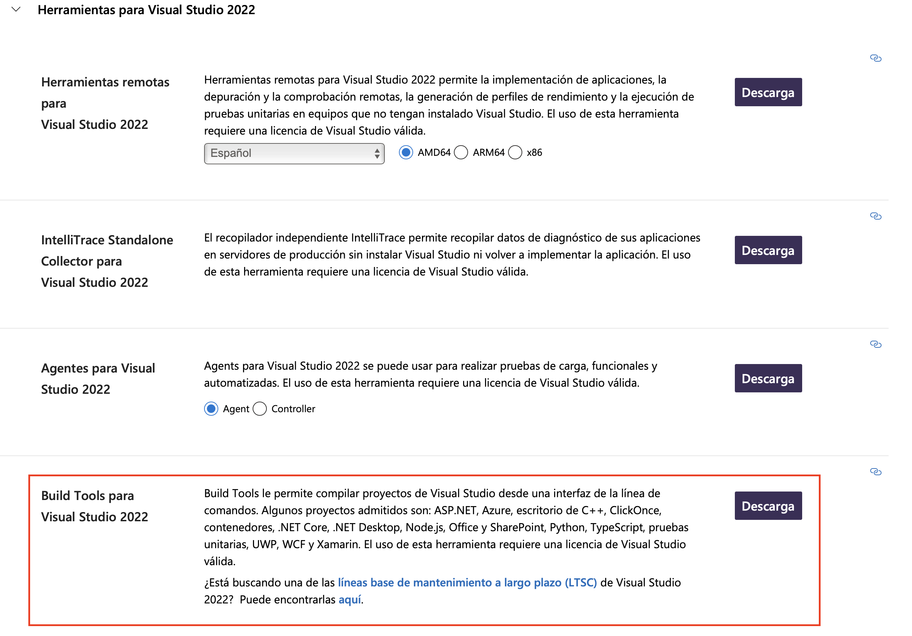
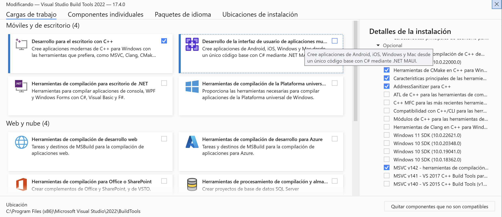

#######
Install
#######

.. raw:: html

    <a href="https://www.kqzyfj.com/click-101359873-15150084?url=https%3A%2F%2Flink.springer.com%2Fbook%2F9783031843037" target="_blank">
        <button style="padding:10px 20px; font-size:16px; background-color: #FFA500; color:white; border:none; border-radius:5px; cursor:pointer; font-weight: bold;">
            Buy Advanced Portfolio Optimization Book on Springer
        </button>
    </a>
     
     

.. raw:: html
    
    <a href="https://www.paypal.com/ncp/payment/GN55W4UQ7VAMN" target="_blank">
        <button style="padding:10px 20px; font-size:16px; background-color: #32CD32; color:white; border:none; border-radius:5px; cursor:pointer; font-weight: bold;">
            Enroll in the Portfolio Optimization with Python Course
        </button>
    </a>
     
     

.. image:: https://img.shields.io/static/v1?label=Sponsor&message=%E2%9D%A4&logo=GitHub&color=%23fe8e86
   :target: https://github.com/sponsors/dcajasn
   :height: 1.75em

.. raw:: html
   
     
   
.. raw:: html

    

Mac OS X, Windows, and Linux
============================

Riskfolio-lib only supports Python 3.10 or higher on OS X, Windows, and Linux. I recommend
using pip for installation.

1. It is highly recommended that you have installed a scientific Python distribution such as `anaconda <https://www.anaconda.com/products/individual>`_ or `winpython <https://winpython.github.io>`_ (Windows only).

2. Install ``Pybind11``.

  ::

      pip install pybind11

3. If you don't have installed cvxpy, you must follow `cvxpy <https://www.cvxpy.org/install/index.html>`_ installation instructions before installing Riskfolio-Lib.

4. Install `Visual Studio Build Tools <https://visualstudio.microsoft.com/es/downloads/>`_ (Only for Windows).

5. Install ``Riskfolio-lib``.

  ::

      pip install riskfolio-lib

6. To run some examples is necessary to install `yfinance <https://pypi.org/project/yfinance/>`_.

  ::

      pip install yfinance
  

7. To run some examples is necessary to install MOSEK, you must follow `MOSEK <https://docs.mosek.com/9.2/install/installation.html>`_ installation instructions. To get a MOSEK license you must go to `Academic Licenses <https://www.mosek.com/products/academic-licenses/>`_.

 ::

      pip install mosek

8. To run the backtesting example is necessary to install `vectorbt <https://vectorbt.dev>`_.

  ::

      pip install vectorbt

Dependencies
============

Riskfolio-Lib has the following dependencies:

* numpy :math:`\geq` 1.26.4
* scipy :math:`\geq` 1.13.0
* pandas :math:`\geq` 2.2.2
* matplotlib :math:`\geq` 3.9.2
* clarabel :math:`\geq` 0.11.1
* SCS :math:`\geq` 3.2.7
* cvxpy :math:`\geq` 1.7.2
* scikit-learn :math:`\geq` 1.7.0
* statsmodels :math:`\geq` 0.14.5
* arch :math:`\geq` 7.2
* xlsxwriter :math:`\geq` 3.2.2
* networkx :math:`\geq` 3.4.2
* astropy :math:`\geq` 6.1.3 (if there are problems check `astropy installation instructions <https://www.astropy.org>`_)
* pybind11 :math:`\geq` 2.13.6
